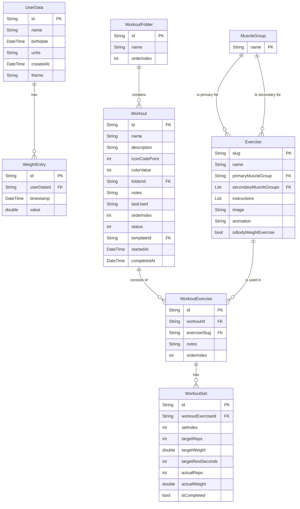

# Database Schema Visualization

This document outlines the database schema for the Zenith fitness application, derived from the Dart models located in `lib/models/`. The schema is presented in a way that can be visualized using Mermaid.js.

## Entity-Relationship Diagram (ERD)

## Table Definitions

### `UserData`
Stores user-specific profile information and preferences.

| Column Name | Data Type | Constraints | Description |
| :--- | :--- | :--- | :--- |
| `id` | String | Primary Key | Unique identifier for the user. (Implicit from `UserData` model, typically a UUID). |
| `name` | String | Not Null | The user's name. |
| `birthdate` | DateTime | Not Null | The user's birthdate. |
| `units` | String | Not Null, Default: 'metric' | The user's preferred unit system ('metric' or 'imperial'). |
| `createdAt` | DateTime | Not Null | Timestamp when the user data was created. |
| `theme` | String | Not Null, Default: 'dark' | The user's preferred app theme. |

### `WeightEntry`
Stores a history of the user's weight entries. Linked to `UserData`.

| Column Name | Data Type | Constraints | Description |
| :--- | :--- | :--- | :--- |
| `id` | String | Primary Key | Unique identifier for the weight entry. (Implicit, typically a UUID). |
| `userDataId` | String | Foreign Key (UserData.id) | Links to the user this entry belongs to. |
| `timestamp` | DateTime | Not Null | Timestamp of when the weight was recorded. |
| `value` | double | Not Null | The weight value. |

### `WorkoutFolder`
Organizes workouts into folders.

| Column Name | Data Type | Constraints | Description |
| :--- | :--- | :--- | :--- |
| `id` | String | Primary Key | Unique identifier for the folder. |
| `name` | String | Not Null | The name of the folder. |
| `orderIndex` | int | Nullable | The order index for sorting folders. |

### `Workout`
Represents a workout template, an in-progress workout session, or a completed workout history entry.

| Column Name | Data Type | Constraints | Description |
| :--- | :--- | :--- | :--- |
| `id` | String | Primary Key | Unique identifier for the workout. |
| `name` | String | Not Null | The name of the workout. |
| `description` | String | Nullable | A brief description of the workout. |
| `iconCodePoint` | int | Nullable | The code point for the workout's icon. |
| `colorValue` | int | Nullable | The color value for the workout. |
| `folderId` | String | Foreign Key (WorkoutFolder.id) | Links to the folder containing this workout. |
| `notes` | String | Nullable | Additional notes for the workout. |
| `lastUsed` | String | Nullable | ISO8601 timestamp of when the workout was last used. |
| `orderIndex` | int | Nullable | The order index for sorting workouts within a folder. |
| `status` | int | Not Null | The status of the workout (0: template, 1: inProgress, 2: completed). Maps to `WorkoutStatus` enum. |
| `templateId` | String | Foreign Key (Workout.id) | If this workout is a session or history entry, links to its original template. |
| `startedAt` | DateTime | Nullable | Timestamp when the workout session started. |
| `completedAt` | DateTime | Nullable | Timestamp when the workout session was completed. |

### `WorkoutExercise`
Represents an exercise that is part of a `Workout`. It links a `Workout` to an `Exercise`.

| Column Name | Data Type | Constraints | Description |
| :--- | :--- | :--- | :--- |
| `id` | String | Primary Key | Unique identifier for the workout exercise entry. |
| `workoutId` | String | Foreign Key (Workout.id) | Links to the workout this exercise belongs to. |
| `exerciseSlug` | String | Foreign Key (Exercise.slug) | The slug of the exercise being performed. |
| `notes` | String | Nullable | Specific notes for this exercise within the workout. |
| `orderIndex` | int | Nullable | The order index for sorting exercises within a workout. |

### `WorkoutSet`
Represents a set of an exercise within a `WorkoutExercise`. Contains both target (template) and actual (logged) values.

| Column Name | Data Type | Constraints | Description |
| :--- | :--- | :--- | :--- |
| `id` | String | Primary Key | Unique identifier for the set. |
| `workoutExerciseId` | String | Foreign Key (WorkoutExercise.id) | Links to the specific workout exercise this set belongs to. |
| `setIndex` | int | Not Null | The index of the set within the exercise (e.g., 1st set, 2nd set). |
| `targetReps` | int | Nullable | Target number of repetitions for the set. |
| `targetWeight` | double | Nullable | Target weight for the set. |
| `targetRestSeconds` | int | Nullable | Target rest time in seconds after the set. |
| `actualReps` | int | Nullable | Actual number of repetitions performed. |
| `actualWeight` | double | Nullable | Actual weight used. |
| `isCompleted` | bool | Not Null, Default: false | Flag indicating if the set has been completed. |

### `Exercise`
A catalog of available exercises.

| Column Name | Data Type | Constraints | Description |
| :--- | :--- | :--- | :--- |
| `slug` | String | Primary Key | Unique identifier for the exercise (e.g., 'bench-press'). |
| `name` | String | Not Null | The common name of the exercise. |
| `primaryMuscleGroup` | String | Foreign Key (MuscleGroup.name) | The primary muscle group targeted by the exercise. |
| `secondaryMuscleGroups`| List (String) | Foreign Key (MuscleGroup.name) | A list of secondary muscle groups involved. (Stored as a serialized list, e.g., JSON string, in a typical DB). |
| `instructions` | List (String) | Nullable | A list of instructions for performing the exercise. (Stored as a serialized list). |
| `image` | String | Nullable | Path or URL to an image of the exercise. |
| `animation` | String | Nullable | Path or URL to an animation demonstrating the exercise. |
| `isBodyWeightExercise`| bool | Not Null, Default: false | Flag indicating if the exercise is a bodyweight exercise (no weight needed). |

### `MuscleGroup`
A lookup table for muscle groups.

| Column Name | Data Type | Constraints | Description |
| :--- | :--- | :--- | :--- |
| `name` | String | Primary Key | The name of the muscle group (e.g., 'Chest', 'Quads'). |

## Relationships

1.  **UserData to WeightEntry**: One-to-Many.
    *   A single `UserData` record can have multiple `WeightEntry` records.
    *   Each `WeightEntry` belongs to one `UserData` record via `userDataId`.

2.  **WorkoutFolder to Workout**: One-to-Many.
    *   A `WorkoutFolder` can contain multiple `Workout` records.
    *   A `Workout` can optionally belong to one `WorkoutFolder` via the `folderId` foreign key in the `Workout` table.
    *   **Implementation Note**: The `WorkoutFolder` model itself does not contain a list of `workoutId`s. Instead, each `Workout` holds a reference (`folderId`) to the `WorkoutFolder` it belongs to. To find all workouts in a folder, you query the `Workout` table for records matching the folder's `id`. This is a standard and scalable database design pattern.

3.  **Workout to WorkoutExercise**: One-to-Many.
    *   A `Workout` consists of multiple `WorkoutExercise` records.
    *   Each `WorkoutExercise` belongs to one `Workout` via `workoutId`.

4.  **WorkoutExercise to WorkoutSet**: One-to-Many.
    *   A `WorkoutExercise` can have multiple `WorkoutSet` records.
    *   Each `WorkoutSet` belongs to one `WorkoutExercise` via `workoutExerciseId`.

5.  **Exercise to WorkoutExercise**: One-to-Many.
    *   An `Exercise` (defined by its `slug`) can be used in many `WorkoutExercise` records across different workouts.
    *   Each `WorkoutExercise` references one `Exercise` via `exerciseSlug`.

6.  **MuscleGroup to Exercise**:
    *   **Primary Muscle Group**: Many-to-One.
        *   Many `Exercise` records can have the same `primaryMuscleGroup`.
        *   Each `Exercise` has one `primaryMuscleGroup` (referenced by `name`).
    *   **Secondary Muscle Groups**: Many-to-Many.
        *   An `Exercise` can have multiple `secondaryMuscleGroups`.
        *   A `MuscleGroup` can be a secondary group for many `Exercise` records. This is typically implemented by storing a list of muscle group names/IDs in the `Exercise` table.

7.  **Workout (Template) to Workout (Session/History)**: One-to-Many (Self-referential).
    *   A `Workout` with `status = template` can be the origin for multiple `Workout` records with `status = inProgress` or `status = completed`.
    *   These session/history records link back to their template via the `templateId` field.

## Notes

*   **Primary Keys**: Most tables use a String `id` as the primary key, which is typically a UUID (as suggested by the `const Uuid().v4()` usage in the Dart models). `Exercise` uses `slug` and `MuscleGroup` uses `name` as their natural primary keys.
*   **Foreign Keys**: Foreign key relationships are indicated by the "FK" constraint. Referential integrity should be enforced at the database level or application level.
*   **Data Types**: Data types are mapped from Dart types to common SQL-like types. Actual implementation might vary slightly depending on the specific database system used (e.g., SQLite, PostgreSQL).
    *   `DateTime` in Dart typically maps to `TEXT` (ISO8601 string), `INTEGER` (Unix timestamp), or a native `DATETIME` type.
    *   `bool` in Dart maps to `INTEGER` (0 for false, 1 for true) or a native `BOOLEAN` type.
    *   `List` types in Dart (like `secondaryMuscleGroups` and `instructions` in `Exercise`) are typically serialized to a string format (e.g., JSON) for storage in a single `TEXT` column.
*   **Nullable Fields**: Columns that can be null are marked as "Nullable".
*   **Enums**: The `WorkoutStatus` enum in the `Workout` model is stored as an `int` representing the enum's index.
*   **`WorkoutHistory` and `WorkoutSession`**: As per the provided Dart files (`workout_history.dart` and `workout_session.dart`), these are typedefs or re-exports of `Workout` and `WorkoutExercise` respectively. This means the `Workout` table is used to store both templates and historical/session data, distinguished by the `status` and `templateId` fields. There isn't a separate `WorkoutHistory` or `WorkoutSession` table.
