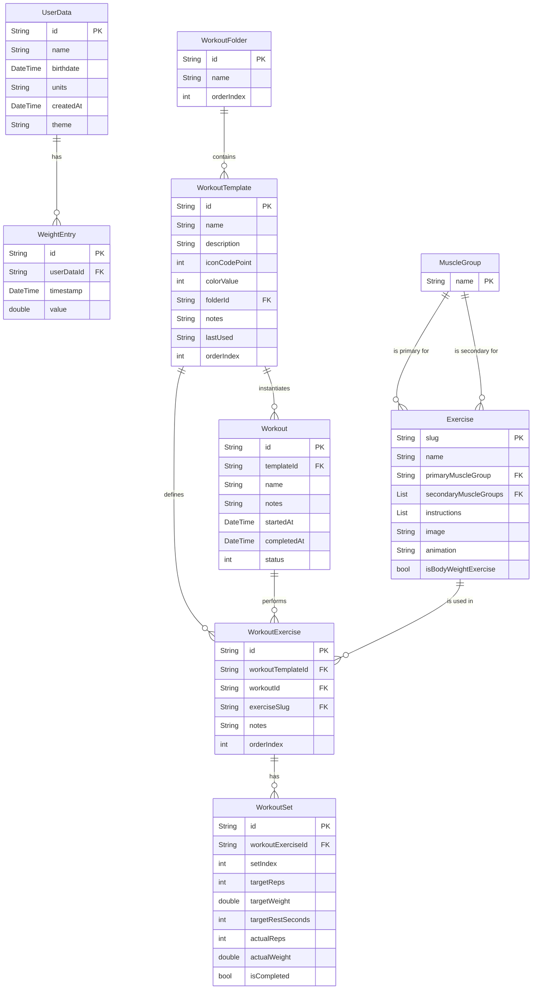

# Database Schema Visualization

This document outlines the database schema for the Zenith fitness application, derived from the Dart models located in `lib/models/`. The schema is presented in a way that can be visualized using Mermaid.js.

## Entity-Relationship Diagram (ERD)

## Table Definitions

### `UserData`
Stores user-specific profile information and preferences.

| Column Name | Data Type | Constraints | Description |
| :--- | :--- | :--- | :--- |
| `id` | String | Primary Key | Unique identifier for the user. (Implicit from `UserData` model, typically a UUID). |
| `name` | String | Not Null | The user's name. |
| `birthdate` | DateTime | Not Null | The user's birthdate. |
| `units` | String | Not Null, Default: 'metric' | The user's preferred unit system ('metric' or 'imperial'). |
| `createdAt` | DateTime | Not Null | Timestamp when the user data was created. |
| `theme` | String | Not Null, Default: 'dark' | The user's preferred app theme. |

### `WeightEntry`
Stores a history of the user's weight entries. Linked to `UserData`.

| Column Name | Data Type | Constraints | Description |
| :--- | :--- | :--- | :--- |
| `id` | String | Primary Key | Unique identifier for the weight entry. (Implicit, typically a UUID). |
| `userDataId` | String | Foreign Key (UserData.id) | Links to the user this entry belongs to. |
| `timestamp` | DateTime | Not Null | Timestamp of when the weight was recorded. |
| `value` | double | Not Null | The weight value. |

### `WorkoutFolder`
Organizes workout templates into folders.

| Column Name | Data Type | Constraints | Description |
| :--- | :--- | :--- | :--- |
| `id` | String | Primary Key | Unique identifier for the folder. |
| `name` | String | Not Null | The name of the folder. |
| `orderIndex` | int | Nullable | The order index for sorting folders. |

### `WorkoutTemplate`
Represents a reusable workout template that users create to define their workout structure.

| Column Name | Data Type | Constraints | Description |
| :--- | :--- | :--- | :--- |
| `id` | String | Primary Key | Unique identifier for the workout template. |
| `name` | String | Not Null | The name of the workout template. |
| `description` | String | Nullable | A brief description of the workout template. |
| `iconCodePoint` | int | Nullable | The code point for the workout's icon. |
| `colorValue` | int | Nullable | The color value for the workout. |
| `folderId` | String | Foreign Key (WorkoutFolder.id) | Links to the folder containing this template. |
| `notes` | String | Nullable | Additional notes for the workout template. |
| `lastUsed` | String | Nullable | ISO8601 timestamp of when the template was last used to start a workout. |
| `orderIndex` | int | Nullable | The order index for sorting templates within a folder. |

### `Workout`
Represents an actual workout session (either in-progress or completed) that was started from a template.

| Column Name | Data Type | Constraints | Description |
| :--- | :--- | :--- | :--- |
| `id` | String | Primary Key | Unique identifier for the workout session. |
| `templateId` | String | Foreign Key (WorkoutTemplate.id) | Links to the template this workout was started from. |
| `name` | String | Not Null | The name of the workout (copied from template, but can be modified). |
| `notes` | String | Nullable | Session-specific notes for this workout instance. |
| `startedAt` | DateTime | Not Null | Timestamp when the workout session started. |
| `completedAt` | DateTime | Nullable | Timestamp when the workout session was completed (null if in-progress). |
| `status` | int | Not Null | The status of the workout (0: inProgress, 1: completed). Maps to `WorkoutSessionStatus` enum. |

### `WorkoutExercise`
Represents an exercise within a workout. Can belong to either a template (for defining structure) or a workout session (for tracking performance).

| Column Name | Data Type | Constraints | Description |
| :--- | :--- | :--- | :--- |
| `id` | String | Primary Key | Unique identifier for the workout exercise entry. |
| `workoutTemplateId` | String | Foreign Key (WorkoutTemplate.id), Nullable | Links to the template if this is a template exercise. |
| `workoutId` | String | Foreign Key (Workout.id), Nullable | Links to the workout session if this is a session exercise. |
| `exerciseSlug` | String | Foreign Key (Exercise.slug) | The slug of the exercise being performed. |
| `notes` | String | Nullable | Specific notes for this exercise within the workout. |
| `orderIndex` | int | Nullable | The order index for sorting exercises within a workout. |

**Note**: Either `workoutTemplateId` or `workoutId` must be set, but not both. This allows the same table to store both template exercises and session exercises.

### `WorkoutSet`
Represents a set of an exercise within a `WorkoutExercise`. Contains both target (from template) and actual (logged during session) values.

| Column Name | Data Type | Constraints | Description |
| :--- | :--- | :--- | :--- |
| `id` | String | Primary Key | Unique identifier for the set. |
| `workoutExerciseId` | String | Foreign Key (WorkoutExercise.id) | Links to the specific workout exercise this set belongs to. |
| `setIndex` | int | Not Null | The index of the set within the exercise (e.g., 1st set, 2nd set). |
| `targetReps` | int | Nullable | Target number of repetitions for the set (from template). |
| `targetWeight` | double | Nullable | Target weight for the set (from template). |
| `targetRestSeconds` | int | Nullable | Target rest time in seconds after the set. |
| `actualReps` | int | Nullable | Actual number of repetitions performed (logged during session). |
| `actualWeight` | double | Nullable | Actual weight used (logged during session). |
| `isCompleted` | bool | Not Null, Default: false | Flag indicating if the set has been completed. |

### `Exercise`
A catalog of available exercises.

| Column Name | Data Type | Constraints | Description |
| :--- | :--- | :--- | :--- |
| `slug` | String | Primary Key | Unique identifier for the exercise (e.g., 'bench-press'). |
| `name` | String | Not Null | The common name of the exercise. |
| `primaryMuscleGroup` | String | Foreign Key (MuscleGroup.name) | The primary muscle group targeted by the exercise. |
| `secondaryMuscleGroups`| List (String) | Foreign Key (MuscleGroup.name) | A list of secondary muscle groups involved. (Stored as a serialized list, e.g., JSON string, in a typical DB). |
| `instructions` | List (String) | Nullable | A list of instructions for performing the exercise. (Stored as a serialized list). |
| `image` | String | Nullable | Path or URL to an image of the exercise. |
| `animation` | String | Nullable | Path or URL to an animation demonstrating the exercise. |
| `isBodyWeightExercise`| bool | Not Null, Default: false | Flag indicating if the exercise is a bodyweight exercise (no weight needed). |

### `MuscleGroup`
A lookup table for muscle groups.

| Column Name | Data Type | Constraints | Description |
| :--- | :--- | :--- | :--- |
| `name` | String | Primary Key | The name of the muscle group (e.g., 'Chest', 'Quads'). |

## Relationships

1.  **UserData to WeightEntry**: One-to-Many.
    *   A single `UserData` record can have multiple `WeightEntry` records.
    *   Each `WeightEntry` belongs to one `UserData` record via `userDataId`.

2.  **WorkoutFolder to WorkoutTemplate**: One-to-Many.
    *   A `WorkoutFolder` can contain multiple `WorkoutTemplate` records.
    *   A `WorkoutTemplate` can optionally belong to one `WorkoutFolder` via the `folderId` foreign key.
    *   **Implementation Note**: Each `WorkoutTemplate` holds a reference (`folderId`) to the `WorkoutFolder` it belongs to. To find all templates in a folder, query the `WorkoutTemplate` table for records matching the folder's `id`.

3.  **WorkoutTemplate to Workout**: One-to-Many.
    *   A `WorkoutTemplate` can be used to start multiple `Workout` sessions.
    *   Each `Workout` session is linked to exactly one `WorkoutTemplate` via `templateId`.
    *   This allows users to reuse templates and track the history of workouts performed from each template.

4.  **WorkoutTemplate to WorkoutExercise**: One-to-Many.
    *   A `WorkoutTemplate` defines multiple `WorkoutExercise` records that form the template structure.
    *   Template exercises have `workoutTemplateId` set and `workoutId` as null.

5.  **Workout to WorkoutExercise**: One-to-Many.
    *   A `Workout` session performs multiple `WorkoutExercise` records.
    *   Session exercises have `workoutId` set and `workoutTemplateId` as null.
    *   When a workout is started from a template, the template's exercises are copied to create session exercises.

6.  **WorkoutExercise to WorkoutSet**: One-to-Many.
    *   A `WorkoutExercise` can have multiple `WorkoutSet` records.
    *   Each `WorkoutSet` belongs to one `WorkoutExercise` via `workoutExerciseId`.

7.  **Exercise to WorkoutExercise**: One-to-Many.
    *   An `Exercise` (defined by its `slug`) can be used in many `WorkoutExercise` records across different templates and sessions.
    *   Each `WorkoutExercise` references one `Exercise` via `exerciseSlug`.

8.  **MuscleGroup to Exercise**:
    *   **Primary Muscle Group**: Many-to-One.
        *   Many `Exercise` records can have the same `primaryMuscleGroup`.
        *   Each `Exercise` has one `primaryMuscleGroup` (referenced by `name`).
    *   **Secondary Muscle Groups**: Many-to-Many.
        *   An `Exercise` can have multiple `secondaryMuscleGroups`.
        *   A `MuscleGroup` can be a secondary group for many `Exercise` records.

## Workflow

1. **Creating a Template**: User creates a `WorkoutTemplate` with associated `WorkoutExercise` records and `WorkoutSet` records that define target values.

2. **Starting a Workout**: When a user starts a workout from a template:
   - A new `Workout` record is created with `status = inProgress` and `templateId` linking to the template
   - The template's `WorkoutExercise` records are copied to create session-specific exercises
   - The template's `WorkoutSet` records are copied with target values preserved

3. **During Workout**: User logs actual performance by updating `actualReps`, `actualWeight`, and `isCompleted` in the session's `WorkoutSet` records.

4. **Completing a Workout**: When finished, the `Workout` record is updated with `status = completed` and `completedAt` timestamp.

## Notes

*   **Primary Keys**: Most tables use a String `id` as the primary key, typically a UUID. `Exercise` uses `slug` and `MuscleGroup` uses `name` as natural primary keys.
*   **Foreign Keys**: Foreign key relationships are indicated by the "FK" constraint. Referential integrity should be enforced at the database or application level.
*   **Data Types**: Data types are mapped from Dart types to common SQL-like types. Actual implementation might vary depending on the database system used.
    *   `DateTime` in Dart typically maps to `TEXT` (ISO8601 string), `INTEGER` (Unix timestamp), or a native `DATETIME` type.
    *   `bool` in Dart maps to `INTEGER` (0 for false, 1 for true) or a native `BOOLEAN` type.
    *   `List` types in Dart are typically serialized to a string format (e.g., JSON) for storage.
*   **Nullable Fields**: Columns that can be null are marked as "Nullable".
*   **Enums**: The `WorkoutSessionStatus` enum is stored as an `int` representing the enum's index.
*   **Separation of Concerns**: The separation of `WorkoutTemplate` from `Workout` provides:
    *   Clear distinction between templates (reusable workout definitions) and sessions (actual workout instances)
    *   Better data organization and query performance
    *   Easier tracking of workout history and template usage
    *   Flexibility to modify session data without affecting the original template
